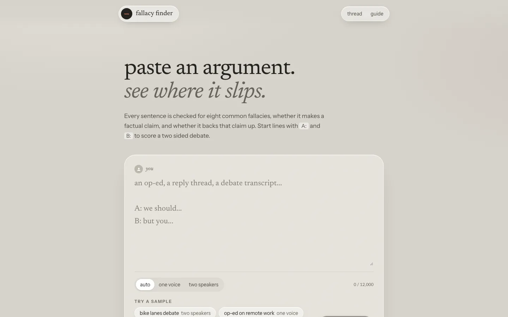
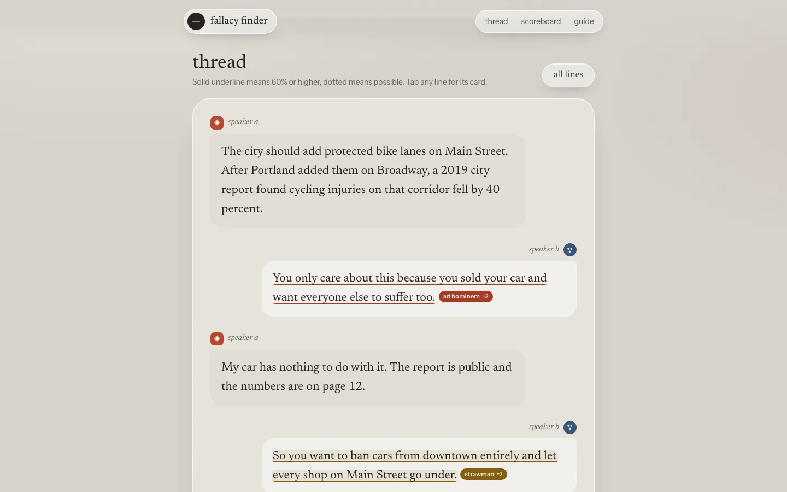

# fallacy finder

See where an argument slips, line by line.

**Live demo:** https://fallacy-finder-nine.vercel.app


## How it works

Paste an argument, a reply thread, an op-ed or a debate transcript and fallacy finder marks the lines that lean on a common fallacy. Lines starting with `A:` and `B:` are read as two speakers, rendered as a chat thread, and scored side by side. The text is split into up to 20 sentences and each one goes to TypeSafe's Jev model with eight yes or no fallacy questions (ad hominem, strawman, false dilemma, slippery slope, appeal to authority, whataboutism, hasty generalization, circular reasoning), two more on whether it makes a factual claim and whether it backs it up, and a 0 to 3 score for argument strength. Jev only returns probabilities and scores. Every word of explanation in the app comes from a hand written field guide.

## Screenshots





A longer recording is in [docs/demo.mp4](docs/demo.mp4).

## Stack

Next.js 16 (App Router), React 19, Tailwind CSS v4, TypeScript and the Vercel AI SDK, deployed on Vercel. Jev calls go through Vercel AI Gateway and fall back to the TypeSafe API. Unit tests use the Node test runner.

## Run it

```bash
npm install
cp .env.example .env.local   # add AI_GATEWAY_API_KEY and/or TYPESAFE_API_KEY
npm run dev
```

`npm test` runs the unit tests for the splitting and scoring logic. `npm run build && npx next start -p 3104` runs the production build.

## Config

| Variable | Default | What it does |
| --- | --- | --- |
| `AI_GATEWAY_API_KEY` | one of the two | Vercel AI Gateway key, tried first |
| `TYPESAFE_API_KEY` | one of the two | TypeSafe API key, used when the Gateway is missing or fails |
| `RATE_LIMIT_ANALYZE` | `5` | checks per IP per window |
| `RATE_LIMIT_WINDOW_MS` | `3600000` | window length, one hour |

Input is capped at 12,000 characters and 20 sentences. A line is flagged at 60% or higher and shown as possible from 50%. The rate limiter is in memory, so it is per serverless instance.

## Related

Built alongside [ToneRadar](https://toneradar.vercel.app), [Headline Arena](https://headline-arena-gamma.vercel.app), [FinePrint](https://fineprint-beta.vercel.app) and [PitchPanel](https://pitchpanel.vercel.app), all on TypeSafe Jev. The first one was [JobFit](https://github.com/Sahilll15/jobfit).
